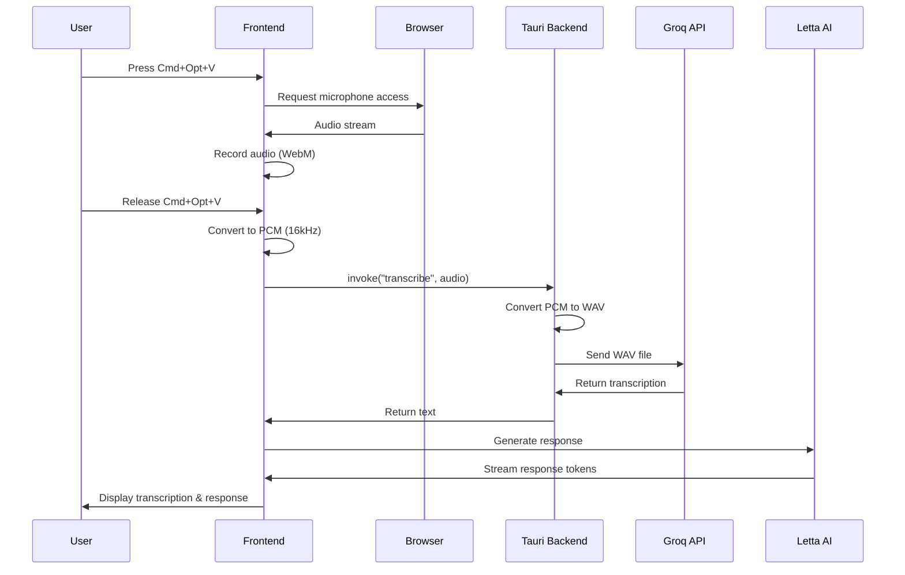
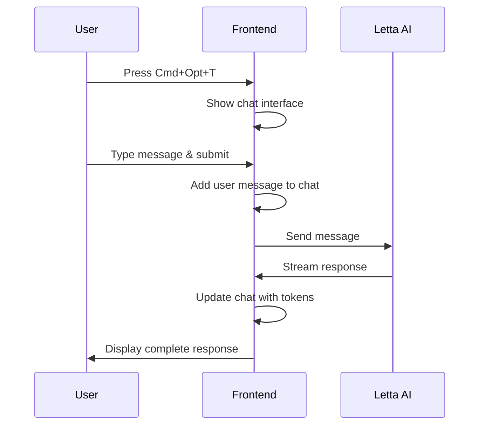

## Overview

Dashi is built on a hybrid architecture combining Next.js for the frontend and Tauri for native desktop capabilities. This architecture enables a smooth, performant AI assistant experience with real-time voice transcription and chat interfaces.

<CardGroup cols={2}>
  <Card title="Frontend Layer" icon="react">
    Next.js 15 with React 19, Framer Motion animations, and Tailwind CSS styling
  </Card>
  <Card title="Backend Layer" icon="rust">
    Tauri 2.5 with Rust backend for native system access and audio processing
  </Card>
  <Card title="AI Services" icon="brain">
    Groq API for speech-to-text transcription and Letta AI for conversational responses
  </Card>
  <Card title="Desktop Native" icon="window">
    Native desktop app capabilities with cross-platform support via Tauri
  </Card>
</CardGroup>

## Tech Stack

### Frontend Technologies

<CardGroup cols={2}>
  <Card title="Next.js 15.3.4" icon="nextjs">
    React-based framework with App Router, TypeScript support, and Turbopack bundler
  </Card>
  <Card title="React 19.0.0" icon="react">
    Latest React with concurrent features and improved performance
  </Card>
  <Card title="Framer Motion 12.18.1" icon="wand-magic-sparkles">
    Smooth animations for Dashi's animated UI states and transitions
  </Card>
  <Card title="Tailwind CSS 4" icon="palette">
    Utility-first CSS framework for responsive, modern styling
  </Card>
</CardGroup>

### Backend Technologies

<CardGroup cols={2}>
  <Card title="Tauri 2.5.0" icon="rust">
    Rust-powered desktop app framework for native capabilities
  </Card>
  <Card title="Hound 3.5.1" icon="waveform">
    WAV audio file encoding/decoding for audio processing
  </Card>
  <Card title="Tokio 1.45.1" icon="bolt">
    Async runtime for handling concurrent operations
  </Card>
  <Card title="groq_api_rust" icon="microphone">
    Custom Groq API client for Whisper-based speech-to-text
  </Card>
</CardGroup>

### AI & Integration Services

<CardGroup cols={2}>
  <Card title="Groq API" icon="cloud">
    Powers speech-to-text using Whisper Large V3 model
  </Card>
  <Card title="Letta AI Client" icon="message-bot">
    Conversational AI agent for generating contextual responses
  </Card>
  <Card title="CopilotKit" icon="code">
    AI copilot integration for enhanced user interactions
  </Card>
</CardGroup>

## Architecture Layers

### 1. Presentation Layer (Next.js Frontend)

The frontend is a Next.js 15 application using the App Router pattern:

```typescript
// src/app/page.tsx
import AnimatedVectorBox from "@/components/ui/dashimain";

export default function Home() {
  return (
    <main className="flex min-h-screen items-start justify-center p-4">
      <AnimatedVectorBox width={boxWidth} vectorPaths={vectorPaths} />
    </main>
  );
}
```

**Key Features:**
- Client-side rendered components with "use client" directive
- Framer Motion animations for Dashi's face and UI transitions
- State management using React hooks
- Keyboard shortcuts (Cmd+Opt+V for voice, Cmd+Opt+T for chat)

### 2. Application Layer (React Components)

The main Dashi component (`dashimain.tsx`) handles:
- **Voice recording** via `useVoiceRecorder` hook
- **State management** for UI modes (default, voice, chat)
- **Animation orchestration** using Framer Motion
- **Chat interface** with real-time streaming responses

```typescript
// src/components/ui/dashimain.tsx
const { startRecording, stopAndTranscribe, isRecording } = useVoiceRecorder();

const handleKeyDown = async (event: KeyboardEvent) => {
  if ((event.metaKey || event.ctrlKey) && event.altKey && isVKey) {
    await startRecording();
  }
};
```

### 3. Integration Layer (Hooks & Services)

**Voice Recording Hook** (`src/lib/tts.ts`):
```typescript
export function useVoiceRecorder(): UseVoiceRecorderResult {
  // Captures audio via MediaRecorder API
  // Converts to PCM format at 16kHz
  // Invokes Tauri backend for transcription
  const transcription = await invoke<string>("transcribe", {
    audio: audioSamples,
  });
}
```

**Letta AI Integration** (`src/lib/letta.ts`):
```typescript
export const generate_response = async (input: string) => {
  const stream = await letta_client.agents.messages.createStream(agent_id, {
    messages: [{ role: "user", content: input }],
    streamTokens: true,
  });
  return stream;
};
```

### 4. Native Backend Layer (Tauri + Rust)

The Rust backend provides native capabilities:

**Entry Point** (`src-tauri/src/lib.rs`):
```rust
pub fn run() {
  tauri::Builder::default()
    .setup(|app| {
      // Initialize logging
      Ok(())
    })
    .invoke_handler(tauri::generate_handler![transcribe])
    .run(tauri::generate_context!())
    .expect("error while running tauri application");
}
```

**Audio Processing** (`src-tauri/src/audio.rs`):
- Converts PCM audio data to WAV format using Hound
- Sends to Groq API for transcription
- Returns transcribed text to frontend

### 5. External Services Layer

**Groq API:**
- Model: `whisper-large-v3`
- Temperature: 0.7
- Language: English
- Returns transcribed text from audio input

**Letta AI:**
- Local server at `http://localhost:8283`
- Streaming response support
- Agent-based conversational AI

## Data Flow

### Voice Transcription Flow



### Chat Message Flow



## Project Structure

```
dashi/
├── src/                          # Next.js frontend
│   ├── app/
│   │   ├── layout.tsx           # Root layout with CopilotKit
│   │   ├── page.tsx             # Main page with Dashi
│   │   └── globals.css          # Global styles
│   ├── components/
│   │   └── ui/
│   │       ├── dashimain.tsx    # Main Dashi component
│   │       ├── button.tsx       # UI components
│   │       └── card.tsx
│   └── lib/
│       ├── tts.ts               # Voice recording hook
│       ├── letta.ts             # Letta AI client
│       └── utils.ts             # Utility functions
├── src-tauri/                    # Rust backend
│   ├── src/
│   │   ├── main.rs              # Entry point
│   │   ├── lib.rs               # Tauri app setup
│   │   └── audio.rs             # Audio processing & transcription
│   ├── Cargo.toml               # Rust dependencies
│   └── tauri.conf.json          # Tauri configuration
├── public/                       # Static assets
│   └── imdashianimate.json      # Lottie animation
├── package.json                  # Node dependencies
└── next.config.js               # Next.js configuration
```

## Communication Protocols

### Frontend to Backend (Tauri IPC)

Tauri provides a type-safe IPC (Inter-Process Communication) layer:

```typescript
// Frontend invokes Rust commands
import { invoke } from "@tauri-apps/api/core";

const result = await invoke<string>("transcribe", {
  audio: audioSamples,
});
```

```rust
// Backend exposes commands
#[tauri::command]
pub async fn transcribe(audio: Vec<f32>) -> Result<String, String> {
  // Process audio and return transcription
}
```

### Frontend to AI Services (HTTP/WebSocket)

- **Groq API**: Called from Rust backend via HTTP REST API
- **Letta AI**: Called from frontend via WebSocket streaming API
- **CopilotKit**: Integrated via React context provider

## Performance Considerations

<CardGroup cols={2}>
  <Card title="Audio Processing" icon="gauge-high">
    Audio is processed at 16kHz sample rate for optimal Whisper model performance
  </Card>
  <Card title="Async Operations" icon="spinner">
    Tokio async runtime prevents blocking on I/O operations
  </Card>
  <Card title="Streaming Responses" icon="stream">
    Letta AI responses stream token-by-token for responsive UX
  </Card>
  <Card title="Native Performance" icon="rocket">
    Tauri provides near-native performance with minimal overhead
  </Card>
</CardGroup>

## Next Steps

<CardGroup cols={2}>
  <Card title="Component Structure" href="/development/components" icon="boxes">
    Explore the React component hierarchy and organization
  </Card>
  <Card title="Tauri Backend" href="/development/tauri-backend" icon="rust">
    Deep dive into the Rust backend implementation
  </Card>
  <Card title="Contributing" href="/development/contributing" icon="git-branch">
    Learn how to contribute to Dashi development
  </Card>
</CardGroup>
